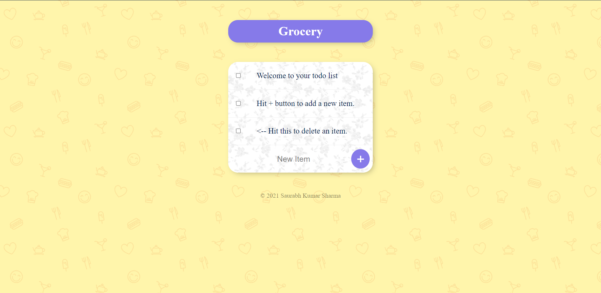
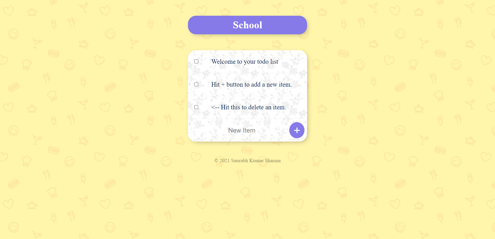
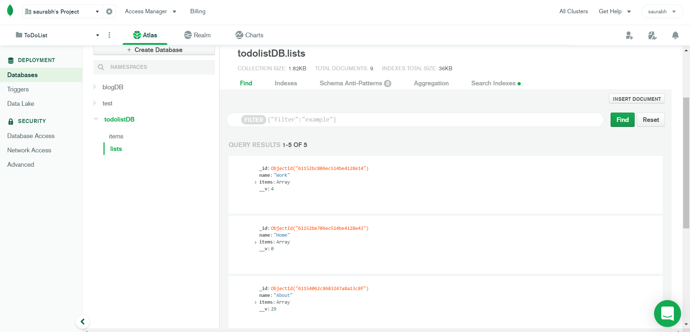

# Blog Website

*  This is a blog website made by using EJS, Node.js, Express.js, Lodash. It also has a MongoDB data base.

 

*  Different list can be made by going to (/"ListName") i.e. (https://whispering-wildwood-37211.herokuapp.com/Work) or (https://whispering-wildwood-37211.herokuapp.com/Home)

## Tech Stack

* **Server:** Node, Express, EJS,
* **DataBase:** MongoDB

  
## Link

[Heroku](https://whispering-wildwood-37211.herokuapp.com/)

## Demo

 

 

 

  
## Authors

- [@s0sharma](https://github.com/s0sharma)

  
